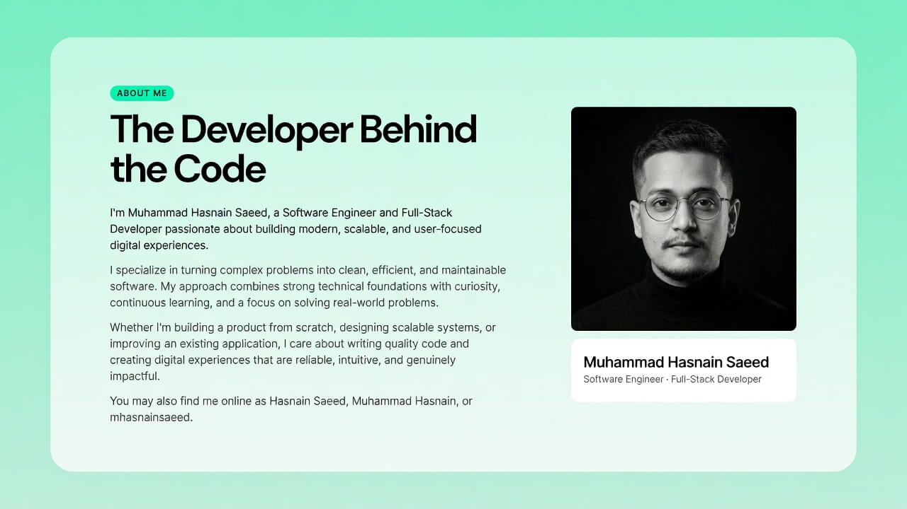

# Muhammad Hasnain Saeed Portfolio



Personal portfolio website built with **Next.js 15**, **React 19**, **TypeScript**, and **Tailwind CSS 4**.

## Features

- Home, About, Projects, Services, FAQ, Credentials, and Contact pages
- Responsive UI
- Dark/light theme support
- SEO metadata and Open Graph setup
- Contact form with email delivery via **Resend**
- Toast notifications for contact form feedback
- Animations with `motion`
- Form validation with `react-hook-form` + `zod`

## Tech Stack

- Next.js 15
- React 19
- TypeScript
- Tailwind CSS 4
- shadcn/ui-style components
- Resend
- Sonner
- Zod
- React Hook Form

## Getting Started

```bash
npm install
npm run dev
```

Open `http://localhost:3000`.

## Build

```bash
npm run build
```

## Environment Variables

Create `.env.local` for local development:

```env
RESEND_API_KEY=your_resend_api_key
RESEND_FROM_EMAIL=onboarding@resend.dev
CONTACT_RECEIVER_EMAIL=your_email@example.com
```

## Contact Form

The contact form submits to `/server/server-action` and sends emails through Resend.

## Deployment

Ready for deployment on Vercel.
